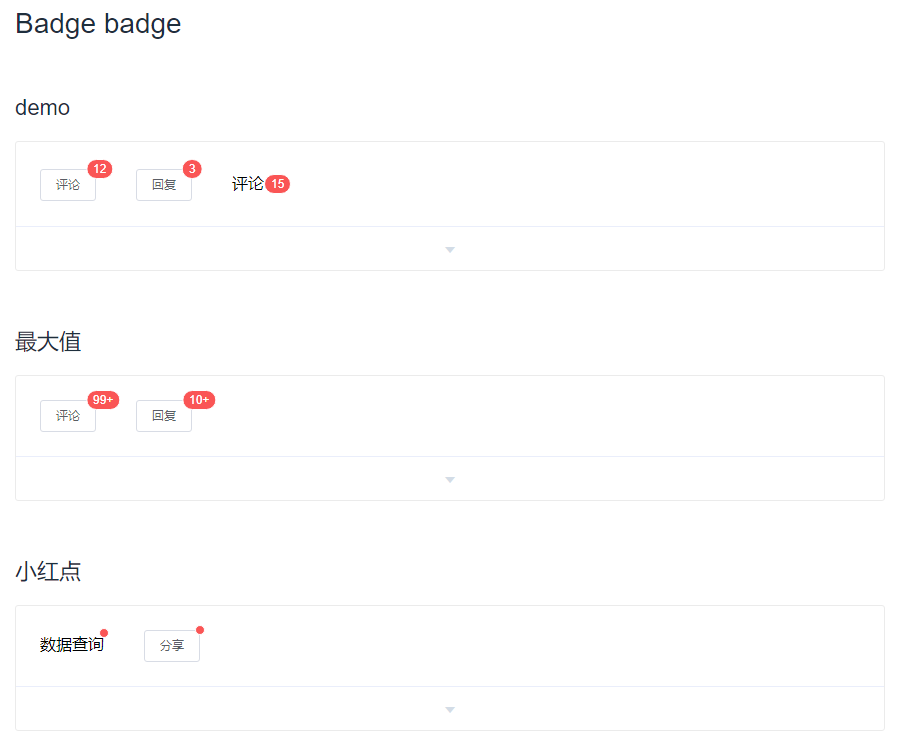

## Badge组件
### 实现效果

首先理一下组件的需求：  
+ 基本功能，在按钮或图标的右上角，显示需要处理的消息数目
+ 状态，提供hidden隐藏功能
+ 进阶，可以单独使用，不用包裹任何元素
+ 功能完善，可以自定义最大显示数目，超出时显示 maxNum+
+ 功能完善，可以自定义展现形式为圆点

通过需求，来思考编写时的问题：  
- 单独使用时，如何去判断它所处的状态（是否包裹了子元素）?  
- 可以显示为数目，也可以显示为圆点。那么，怎么去实现这个效果？v-if v-else?
- 最大数目时，针对全局，怎么写的优雅一点，不通过v-if小于99时，显示number，v-else显示99+?
